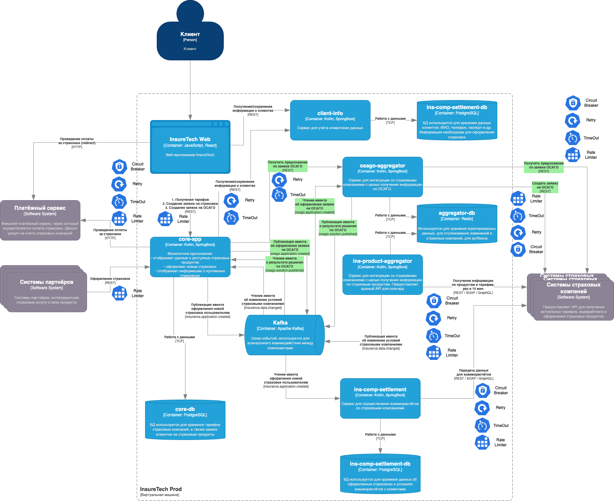

### Задание 4. Проектирование продажи ОСАГО
Компания планирует вскоре запустить новый продукт: оформление ОСАГО онлайн. 
Пользовательский путь выглядит так: 
клиенту предлагается заполнить заявку с информацией о своём автомобиле, 
после этого сервис запрашивает у всех доступных страховых компаний предложения с условиями страхования под заявку клиента. 
Бизнесу важно, чтобы на экране пользователя предложения от каждой страховой компании отображались сразу, 
как только от неё пришёл ответ. Максимальное время ожидания решения от страховой компании — 60 секунд.

Все страховые компании предоставляют однотипные REST API с двумя эндпоинтами:
* создать заявку на ОСАГО,
* получить предложение по заявке.

Бизнес предполагает, что в пик нагрузки количество одновременных пользователей, создающих заявку на ОСАГО, может достигать 2,5 тысячи человек.

Вы обсудили задачу с командой разработки и приняли такие решения:
1. Сохранить подход, который использовался для получения данных о продуктах и тарифах из страховых компаний.
2. Выделить отдельный сервис для взаимодействия со страховыми компаниями — osago-aggregator.

Функциональная обязанность этого сервиса — отправка заявок в страховые компании и дальнейший опрос решений по ним для передачи результатов в core-app. 
Остальная функциональность, связанная с оформлением ОСАГО, остаётся на стороне бэкенда в core-app.

Теперь вам нужно проработать ещё несколько моментов, исходя из требований бизнеса. Доработайте схему, которая у вас получилась в третьем задании. 
Отразите на ней ваши решения по этим вопросам:
1. Проработайте реализацию osago-aggregator. Решите:
2. Требуется ли ему своё хранилище данных? -- да, для отслеживание изменений страховых компаний, для работы с Кафка через аутбокс
3. Какой API он предоставляет core-app? - синхронный REST, чтобы гарантировать ответ в 60 сек, а вот кстати, оформление ОСАГО можно и через Кафку опять сделать
4. Определите средство интеграции между сервисами core-app и osago-aggregator. -- для предоставления тарифов ОСАГО REST, для оформления заявки REST, нр нужно будет доделать диаграммы
5. Подумайте над API для веб-приложения в core-app. -- придумать ручки от монолита для клиента
6. Определите средство интеграции между веб-приложением и core-app. Если будете использовать средство, отличное от REST, отразите интеграцию новой стрелкой. -- тут помоему просто REST
7. В зависимости от выбранных средств интеграции подумайте, требуется ли где-то применение паттернов отказоустойчивости:
   * Rate Limiting, -- пригодится на запросе для получения инфо о тарифах, чтобы не переходить за лимиты внешнего API
   * Circuit Breaker, -- тут уточнить, я не помню что даёт этот паттерн, кажется, он тоже будет при HTTP во внещний сервис
   * Retry, -- при запросе условий по ОСАГО, при запросе на оформление ОСАГО
   * Timeout, -- для гарантии 60 сек ответа от страховых компаний, если нет ответа, то своему пользователю вернем заглушку/ошибку/дефолтное значение
   * Outbox Transactional -- для асинхронного взаимодействия между компонентами системы
   Отобразите применение паттернов на схеме с помощью обозначений из этой библиотеки.
8. Примите во внимание, что сервисы задеплоены в нескольких экземплярах. Подумайте, зависит ли ваше решение от этого. -- подумать тут, я пока не знаю

Загрузите новый вариант схемы в директорию Exc4 в рамках пул-реквеста.

Решение:

Думаю, имеет смысл использовать в качестве хранилища то же самое, что уже использует ins-product-aggregator.
Так мы сможем точно понимать, когда произошло изменение в данных страховых компаний,
не отправляя в очередь ивент, который не изменяет условий.
Также это хранилище я бы использовал для реализации паттерна Transactional Outbox,
поскольку для нас критично не упустить изменения в условиях страхового полиса.
Кроме того, благодаря данному хранилищу мы могли бы проводить аудит изменений страховых планов.

### Диаграмма компонентов системы as-is:

### Диаграмма компонентов системы to-be:

